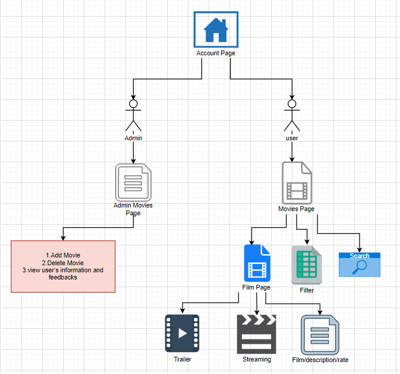
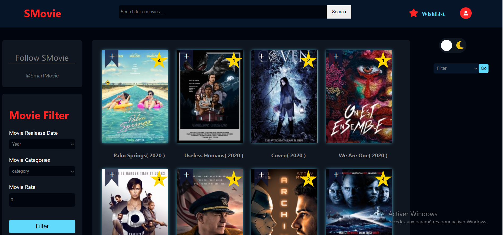
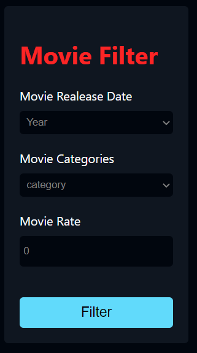
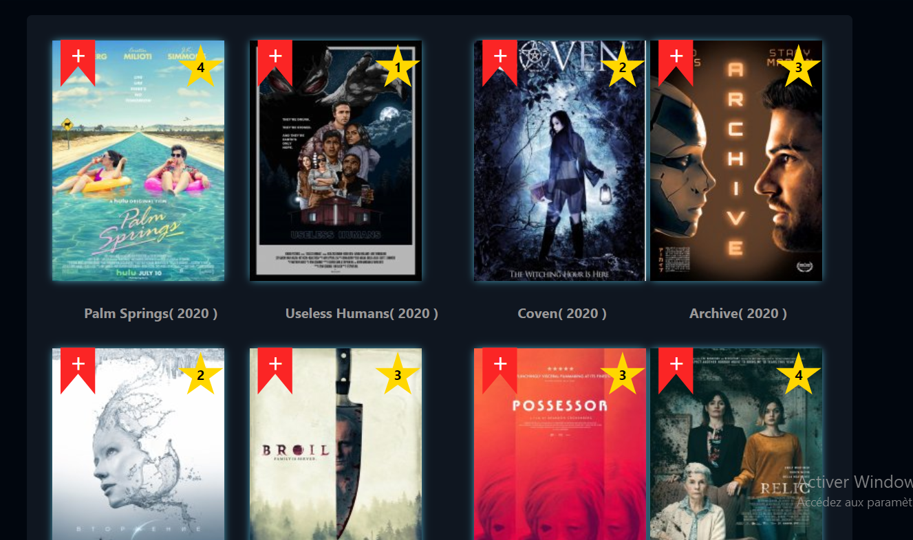
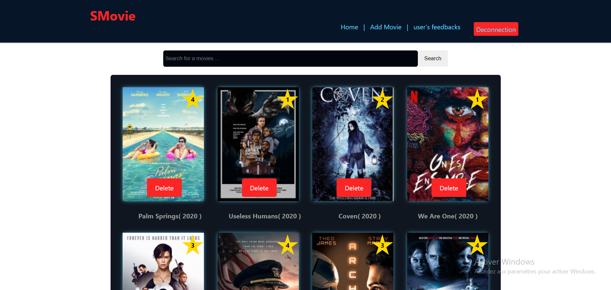
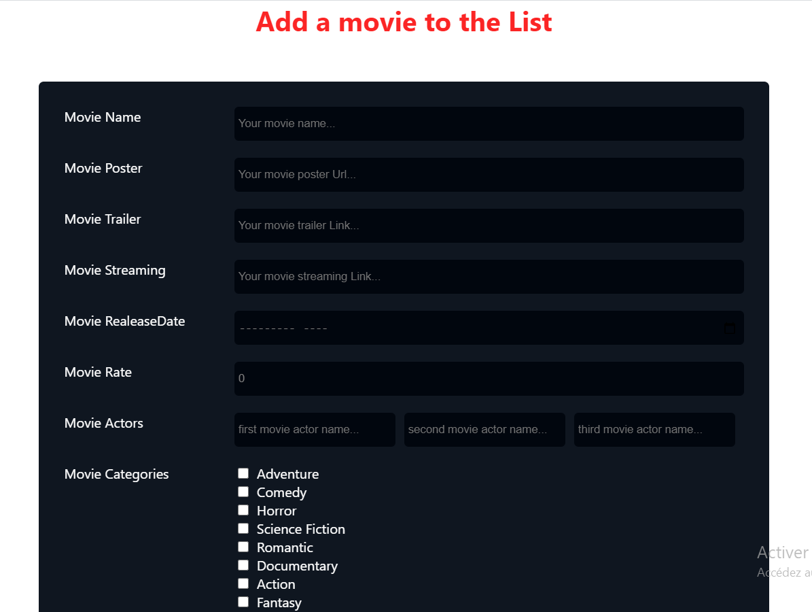
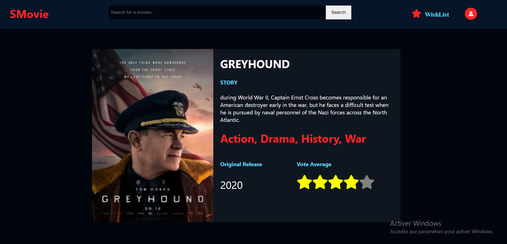

# react-movie-app

A Movie app built with reactjs

[visit site here](lien)

## What is SmartMovie App?

SMovie App is a streaming service that offers a wide variety of award-winning TV shows, movies, anime, documentaries, and more on thousands of internet-connected devices.

In this website, you will get many movies to watch and download by just registering and logging onto the website. This SMovie application has two modules namely Admin and User. Admin can log in, it has access to upload and delete movies. The user has to register then he/she can log in. After logging in he/she can view movies list in library and watch and download movie of his/her interest.

# Screenshots:

### Home Screen

### Movie Screen

##### Filter Screen

##### Pagination Screen

##### WishList Screen

### Admin Screen

##### Adding Movie Screen

### Film Screen

[visit site here](lien)
